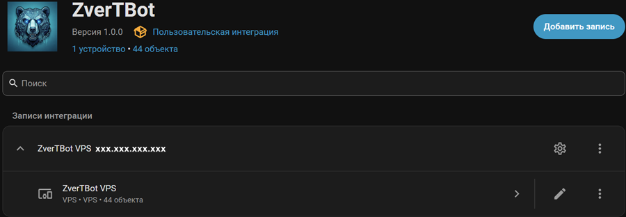
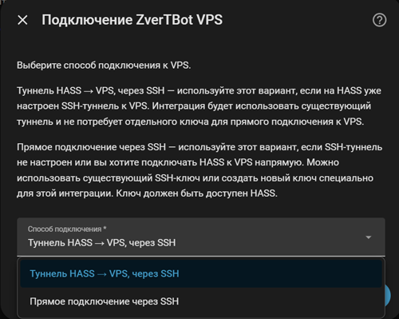
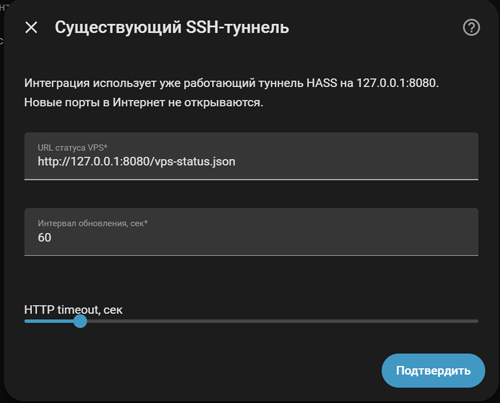
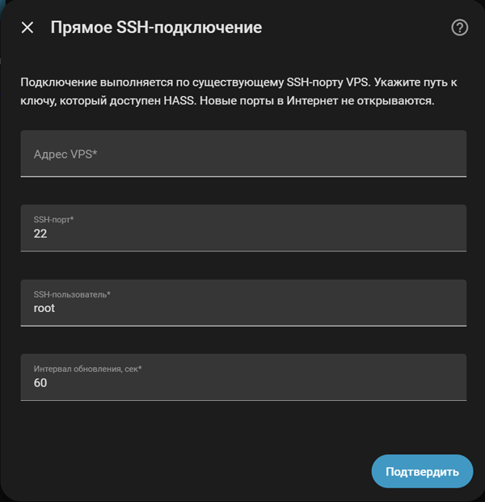
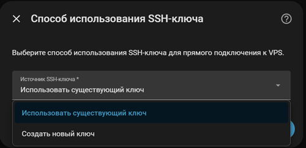
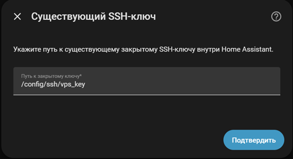
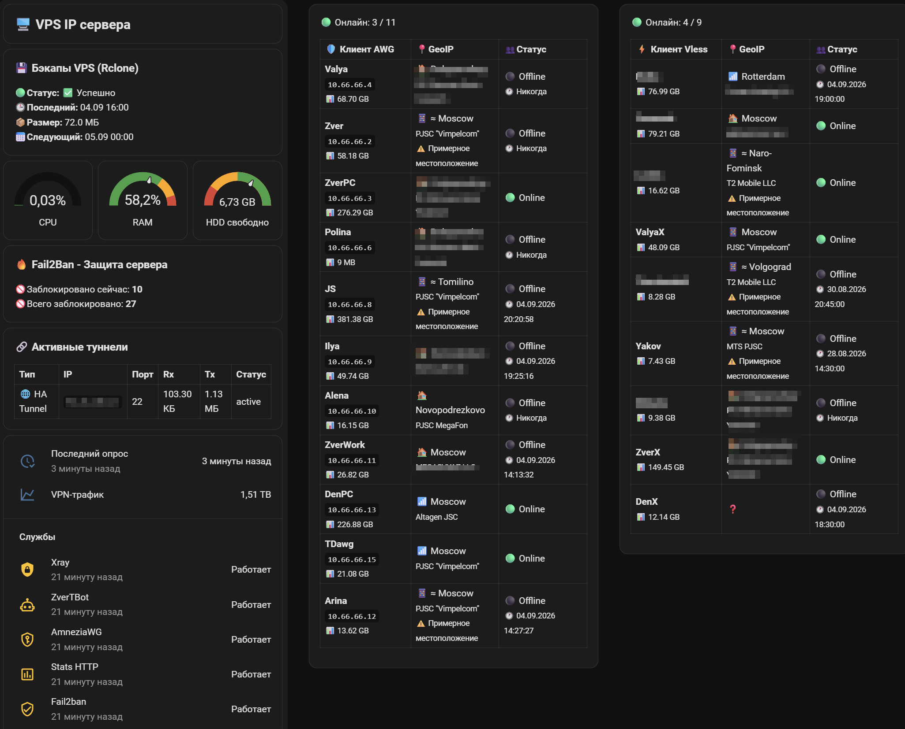
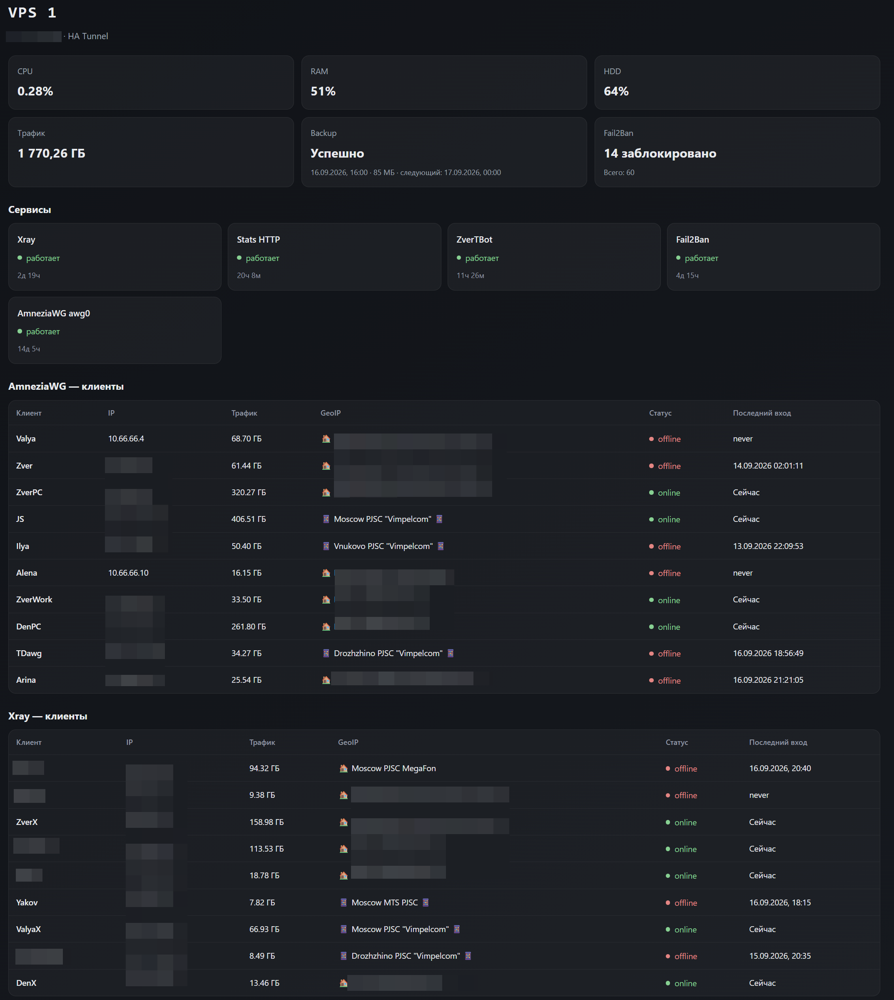

# ZverTBot-ha — интеграция для Home Assistant

**ZverTBot-ha** — интеграция для [Home Assistant](https://www.home-assistant.io/), которая получает статистику VPS и инфраструктуры **ZverTBot** по SSH.

Данные можно использовать в Dashboard, автоматизациях и других компонентах Home Assistant.

Поддерживаются два режима подключения:

* **прямое SSH-подключение к VPS**;
* **существующий SSH-туннель** между Home Assistant и VPS.

Если прямое SSH-подключение уже используется в инфраструктуре, рекомендуется использовать его.

> **ZverTBot-ha не заменяет ZverTBot.**
> ZverTBot отвечает за серверную часть и сбор статистики, а ZverTBot-ha предоставляет Home Assistant доступ к этим данным.

---

## Содержание

* [Возможности](#возможности)
* [Как это работает](#как-это-работает)
* [Установка](#установка)

  * [HACS](#hacs)
  * [Ручная установка](#ручная-установка)
* [Настройка](#настройка)

  * [Существующий SSH-туннель](#существующий-ssh-туннель)
  * [Прямое SSH](#прямое-ssh)
  * [SSH-ключи](#ssh-ключи)
* [Сущности](#сущности)
* [Dashboard](#dashboard)
* [Безопасность](#безопасность)
* [Диагностика](#диагностика)
* [Обновление](#обновление)
* [Удаление](#удаление)
* [Разработка](#разработка)
* [Версия](#версия)
* [Связанные проекты](#связанные-проекты)
* [Лицензия](#лицензия)

---

# Возможности

ZverTBot-ha предоставляет Home Assistant доступ к данным VPS:

* CPU;
* RAM;
* свободное место на диске;
* VPN-трафик;
* состояние сервисов;
* Fail2Ban;
* резервное копирование;
* активные туннели;
* клиенты AmneziaWG;
* клиенты Xray / VLESS;
* статус и трафик клиентов через агрегированные AWG/Xray-сущности;
* GeoIP-информация.

Интеграция также поддерживает:

* прямое SSH-подключение;
* существующий SSH-туннель;
* настройку SSH-порта и пользователя;
* создание SSH-ключа Ed25519;
* использование существующего приватного ключа;
* проверку подключения при настройке;
* настройку интервала обновления;
* обработку ошибок и повторных подключений с задержкой.

---

# Как это работает

```text
┌──────────────────────────┐
│      Home Assistant      │
│                          │
│  ZverTBot-ha             │
│  Dashboard               │
│  Automations             │
└────────────┬─────────────┘
             │
             │ SSH
             │
             ▼
┌──────────────────────────┐
│           VPS            │
│                          │
│  ZverTBot                │
│  VPS statistics          │
│  Xray                    │
│  AmneziaWG               │
│  Fail2Ban                │
│  Backup                  │
└──────────────────────────┘
```

При прямом подключении интеграция устанавливает SSH-соединение с VPS.

При использовании существующего туннеля она использует уже настроенный SSH-канал вместо создания отдельного публичного HTTP-интерфейса.

Отдельный Internet-facing HTTP-порт для работы интеграции не требуется.

---

# Установка

## HACS

Это рекомендуемый способ установки.

Если репозиторий отсутствует в каталоге HACS, добавьте пользовательский репозиторий:

```text
https://github.com/Zver5/ZverTBot-ha
```

Тип:

```text
Integration
```

После установки перезапустите Home Assistant.

Затем:

```text
Настройки → Устройства и службы → Добавить интеграцию
```

Найдите:

```text
ZverTBot VPS
```

### Интеграция



После установки интеграция появляется в Home Assistant как **ZverTBot VPS**.

---

## Ручная установка

Скопируйте:

```text
custom_components/zvertbotvps
```

в:

```text
/config/custom_components/zvertbotvps
```

Структура:

```text
/config/
└── custom_components/
    └── zvertbotvps/
        ├── __init__.py
        ├── config_flow.py
        ├── const.py
        ├── coordinator.py
        ├── keygen.py
        ├── manifest.json
        ├── ssh.py
        └── translations/
```

После копирования перезапустите Home Assistant и добавьте интеграцию:

```text
Настройки → Устройства и службы → Добавить интеграцию → ZverTBot VPS
```

---

# Настройка

Настройка выполняется через стандартный **Config Flow Home Assistant**.

Дополнительный YAML для самой интеграции не требуется.

Во время настройки указываются:

* адрес VPS;
* SSH-порт;
* пользователь;
* способ подключения;
* SSH-ключ;
* параметры существующего туннеля, если выбран этот режим;
* интервал обновления.

Интеграция проверяет подключение во время настройки.

### Выбор способа подключения



---

## Существующий SSH-туннель

Если между Home Assistant и VPS уже работает постоянный SSH-туннель, ZverTBot-ha может использовать его.



Это предпочтительный вариант, если туннель уже используется в инфраструктуре.

Преимущества:

* не требуется дополнительный публичный HTTP-порт;
* не создаются отдельные независимые SSH-соединения для каждого обращения;
* меньше новых SSH-сессий;
* ниже риск срабатывания Fail2Ban;
* используется уже существующая сетевой инфраструктура.

При временной недоступности VPS интеграция использует задержку между повторными попытками, чтобы не создавать поток новых SSH-подключений.

---

## Прямое SSH

Интеграция может подключаться к VPS напрямую.



Потребуются:

* IP-адрес или hostname VPS;
* SSH-порт;
* пользователь;
* приватный SSH-ключ;
* соответствующий публичный ключ на VPS.

Публичный ключ должен находиться в:

```text
~/.ssh/authorized_keys
```

---

# SSH-ключи

Поддерживаются два варианта:

1. создать новый ключ Ed25519;
2. использовать существующий приватный ключ.

## Создание нового ключа

Если подходящего ключа нет, интеграция может создать новый **Ed25519**.



Публичный ключ отображается после создания.

Добавьте его на VPS в:

```text
~/.ssh/authorized_keys
```

После этого можно проверить подключение.

## Использование существующего ключа

Если ключ уже существует, можно указать путь к нему.



Например:

```text
/config/ssh/id_ed25519
```

Интеграция использует этот ключ для SSH-аутентификации.

> **Важно:** приватный ключ нельзя публиковать, помещать в Git или передавать через Issues.

---

# Сущности

После настройки интеграция создаёт сущности Home Assistant, которые можно использовать в Dashboard и автоматизациях.

## VPS

Основные данные:

* CPU;
* RAM;
* диск;
* VPN-трафик;
* время последнего обновления;
* возраст данных.

## Сервисы

Состояние сервисов передаётся через binary sensors.

Например:

```text
binary_sensor.zvertbot_vps_service_xray
binary_sensor.zvertbot_vps_service_zvertbot
binary_sensor.zvertbot_vps_service_awg_quick_awg0
binary_sensor.zvertbot_vps_service_stats_http
binary_sensor.zvertbot_vps_service_fail2ban
```

## VPN-клиенты

Для AmneziaWG и Xray / VLESS подробные данные клиентов доступны в attributes агрегированных сущностей:

* имя;
* Online / Offline;
* последний IP;
* время последнего подключения;
* трафик;
* GeoIP;
* оператор / ISP;
* приблизительное местоположение для мобильных подключений.

Отдельные Home Assistant-сущности для каждого клиента не создаются. Это предотвращает накопление устаревших (zombie) entities при изменении списка клиентов.

## Основные сущности

| Сущность                               | Назначение                  |
| -------------------------------------- | --------------------------- |
| `sensor.zvertbot_vps_all_stats`        | Полная статистика VPS       |
| `sensor.zvertbot_vps_cpu_load`         | Загрузка CPU                |
| `sensor.zvertbot_vps_ram_used`         | Использование RAM           |
| `sensor.zvertbot_vps_disk_free`        | Свободное место             |
| `sensor.zvertbot_vps_vpn_traffic`      | VPN-трафик                  |
| `sensor.zvertbot_vps_stats_last_check` | Время последнего обновления |
| `sensor.zvertbot_vps_status_age`       | Возраст данных              |
| `sensor.zvertbot_vps_awg_clients`      | Клиенты AmneziaWG           |
| `sensor.zvertbot_vps_xray_clients`     | Клиенты Xray / VLESS        |

---

# Dashboard

Интеграция не требует использовать какой-либо конкретный Dashboard.

Для быстрого запуска в репозитории есть готовый пример:

```text
examples/dashboard.yaml
```



Пример показывает:

* VPS и режим подключения;
* CPU, RAM и диск;
* резервное копирование;
* Fail2Ban;
* активные туннели;
* состояние сервисов;
* клиентов AmneziaWG;
* клиентов Xray / VLESS;
* GeoIP;
* трафик;
* время последнего подключения.

> Dashboard является готовым примером интерфейса. Его можно адаптировать под собственный Home Assistant.

### Встроенная VPS-панель

Интеграция включает готовую Lovelace-панель для отображения состояния VPS.



Чтобы добавить панель в Home Assistant:

1. Создайте **новый Dashboard** или откройте существующий.
2. Добавьте новую страницу типа **Panel**.
3. Откройте редактор конфигурации в YAML-режиме.
4. Вставьте следующую конфигурацию:

```yaml
type: panel
title: VPS
icon: mdi:server-network
cards:
  - type: custom:zvertbot-vps-panel-v3
```

5. Сохраните конфигурацию.

JavaScript панели **автоматически регистрируется интеграцией** при запуске Home Assistant. Поэтому отдельно добавлять `/api/zvertbotvps/static/zvertbot-panel.js` в **Settings → Dashboards → Resources** не требуется.

После установки или обновления интеграции перезапустите Home Assistant и откройте созданную страницу Dashboard.

# Безопасность

## SSH

Рекомендуется использовать SSH-ключи вместо парольной аутентификации.

Для новых ключей рекомендуется **Ed25519**.

Приватный ключ:

* не публикуйте;
* не помещайте в Git;
* не передавайте через Issues;
* не храните в публичных репозиториях.

## Публичные порты

Для работы интеграции не требуется открывать отдельный Internet-facing HTTP-порт.

Используется SSH-канал — прямой или существующий туннель.

## Повторные подключения

При недоступности VPS между попытками используется задержка.

Это снижает количество новых SSH-соединений и риск срабатывания Fail2Ban.

Если уже используется постоянный SSH-туннель, предпочтительно использовать именно его.

---

# Диагностика

Если интеграция не подключается, проверьте:

1. адрес VPS;
2. SSH-порт;
3. пользователя;
4. наличие приватного ключа;
5. путь к ключу;
6. права доступа к ключу;
7. наличие публичного ключа в `~/.ssh/authorized_keys`;
8. работу SSH-сервера;
9. сетевую доступность VPS;
10. существующий SSH-туннель, если выбран этот режим.

## Прямое SSH

Для проверки подключения независимо от Home Assistant:

```bash
ssh -i /path/to/private_key -p PORT username@SERVER_IP
```

Если обычное SSH-подключение не работает, сначала необходимо исправить SSH-доступ.

## Существующий туннель

Проверьте:

* состояние туннеля;
* локальную точку подключения;
* SSH-сервис VPS;
* SSH-аутентификацию;
* адрес и порт назначения.

Интеграция не заменяет исправную работу самого туннеля.

## Возраст данных

Если сущности перестали обновляться, сначала проверьте:

```text
sensor.zvertbot_vps_status_age
```

Если возраст данных продолжает увеличиваться, проблема находится в получении статистики, а не в Dashboard.

---

# Обновление

## HACS

Используйте стандартный механизм обновления HACS.

После обновления при необходимости перезапустите Home Assistant.

## Ручная установка

Замените:

```text
/config/custom_components/zvertbotvps
```

на каталог из новой версии.

После этого перезапустите Home Assistant.

---

# Удаление

Удалите интеграцию через:

```text
Настройки → Устройства и службы
```

При ручной установке удалите:

```text
/config/custom_components/zvertbotvps
```

и перезапустите Home Assistant.

Если интеграция создавала отдельный SSH-ключ и он больше не используется, его можно удалить отдельно.

При обновлении с версий, создававших отдельные entities для каждого AWG/Xray-клиента, старые legacy entities удаляются из Entity Registry. Текущие данные клиентов доступны через агрегированные AWG/Xray-сенсоры.

---

# Разработка

Исходный код интеграции:

```text
custom_components/zvertbotvps/
```

```text
custom_components/zvertbotvps/
├── __init__.py
├── config_flow.py
├── const.py
├── coordinator.py
├── keygen.py
├── manifest.json
├── diagnostics.py
├── sensor.py
├── binary_sensor.py
├── ssh.py
└── translations/
```

Тесты:

```text
tests/
```

Запуск:

```bash
pytest -q
```

Проверка Git:

```bash
git diff --check
```

Перед выпуском новой версии рекомендуется выполнить полный набор тестов и проверить интеграцию в Home Assistant.

---

# Версия

```text
1.2.0
```

История изменений находится в [`CHANGELOG.md`](CHANGELOG.md).

---

# Связанные проекты

* **ZverTBot** — серверная система, работающая на VPS:
  https://github.com/Zver5/ZverTBot

* **ZverTBot-ha** — Home Assistant-интеграция:
  https://github.com/Zver5/ZverTBot-ha

* **Home Assistant:**
  https://www.home-assistant.io/

* **HACS:**
  https://hacs.xyz/

---

# Лицензия

Проект распространяется в соответствии с лицензией, указанной в [`LICENSE`](LICENSE).
